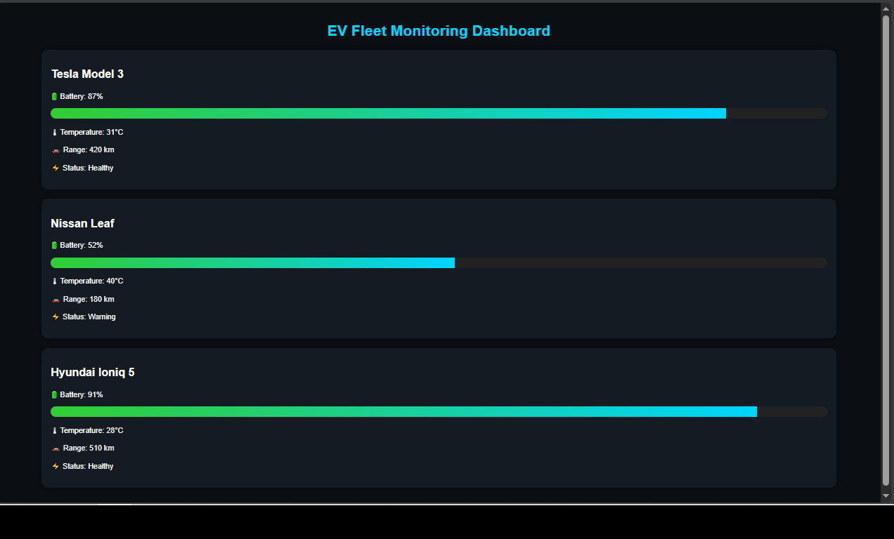

# ⚡ EV Fleet Monitoring Dashboard

A web-based dashboard designed to monitor and visualize electric vehicle fleets.

## 📸 Application Preview



## 🚗 Overview
...

# ⚡ EV Fleet Monitoring Dashboard

A web-based dashboard designed to monitor and visualize the operational status of electric vehicle fleets.

## 🚗 Overview

EV Fleet Monitoring Dashboard provides a centralized view of multiple electric vehicles, displaying key operational metrics such as battery level, temperature, estimated range, and vehicle status.

The project demonstrates the integration of automotive concepts with modern web development technologies and serves as a foundation for future fleet management and telematics systems.

---

## ✨ Features

- Real-time fleet overview
- Battery health monitoring
- Vehicle temperature tracking
- Remaining range visualization
- Fleet status indicators
- Responsive dashboard interface
- Flask-based backend
- Ready for API and telematics integration

---

## 🛠 Technologies Used

- Python
- Flask
- HTML5
- CSS3
- Jinja2 Templates

---

## 📊 Vehicle Metrics

The dashboard displays:

- Battery Level (%)
- Battery Temperature (°C)
- Estimated Driving Range (km)
- Vehicle Operational Status

Example vehicles:

- Tesla Model 3
- Nissan Leaf
- Hyundai Ioniq 5

---

## 🚀 Installation

Clone the repository:

```bash
git clone https://github.com/evdiagnostictech/ev-fleet-monitoring-dashboard
cd ev-fleet-monitoring-dashboard
```

Install dependencies:

```bash
pip install -r requirements.txt
```

Run the application:

```bash
python app.py
```

Open your browser:

```text
http://127.0.0.1:5000
```

---

## 🔮 Future Improvements

- SQLite database integration
- REST API endpoints
- Real-time telemetry
- Vehicle geolocation tracking
- Charging station monitoring
- Fleet analytics
- Predictive maintenance alerts
- User authentication

---

## 🎯 Learning Objectives

This project was developed to strengthen skills in:

- Electric Vehicle Technology
- Fleet Monitoring Systems
- Automotive Software Development
- Backend Development with Flask
- REST APIs
- Dashboard Design

---

## 👨‍💻 Author

Oscar Letelier

📍 Barcelona, Spain

📧 vidalleopoldo330@gmail.com

LinkedIn: www.linkedin.com/in/oscarleteliervidal

---

## 📄 License

This project is intended for educational and portfolio purposes.